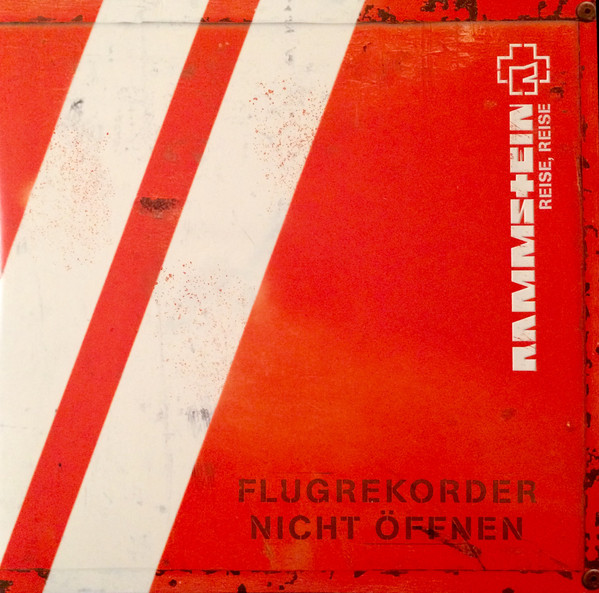

```{r echo = FALSE, message=FALSE}
library(tidyverse)
library(dplyr)
library(spotifyr)
library(ggplot2)
library(grid)
library(gridExtra)
library(plotly)
library(compmus)
library(Rmisc)
library(knitr)
library(tidymodels)
library(ggdendro)
library(heatmaply)
library(kableExtra)
```

```{r echo = FALSE}
all_data_rammstein <- get_playlist_audio_features("","4ubZwxPRbLmmaxwsrcoksY")

rammstein_paris <- get_playlist_audio_features("","4td6SJ4cvyFWgJn9I9EtnT")
rammstein_berlin <- get_playlist_audio_features("","1YWLnvtP4lgROQWB7HqZxT")

  

rammstein <- all_data_rammstein%>%
  select(c(36, 50, 6:16)) %>%
  mutate(
    track.album.release_date = lubridate::year(track.album.release_date)
  )

rammstein_2019 <- rammstein %>%
  filter(track.album.release_date == "2019")

rammstein_1995 <- rammstein %>%
  filter(track.album.release_date == "1995")
  
rammstein_live <- bind_rows(
  rammstein_paris %>% mutate(category = "live at paris"),
  rammstein_berlin %>% mutate(category = "live at berlin") 
  )%>%
  select(c(36, "category", 50, 6:16)) %>% 
  mutate(track.name = str_sub(track.name, 1,-8))

rammstein_not_live <- get_playlist_audio_features("","0A0m04BWQCIozwguPMaRzE") %>%
  select(c(36, 50, 6:16))

rammstein_not_live[29, "track.name"] = "Wilder Wein"

live_not_live <- bind_rows(
  rammstein_live,
  rammstein_not_live %>% mutate(category = "studio")
)

live_not_live <- live_not_live %>% mutate(
  track.name = tolower(track.name)
)

rammstein_sum <- rammstein%>%
  group_by(track.album.release_date)%>%
  summarise(
    mean_speechiness = mean(speechiness),
    mean_acousticness = mean(acousticness),
    mean_liveness = mean(liveness),
    mean_energy = mean(energy),
    mean_danceability = mean(danceability),
    mean_tempo = mean(tempo),
    mean_instrumentalness = mean(instrumentalness),
    mean_key = mean(key),
    mean_valence = mean(valence)
  )


```


### Introduction

Starting in Berlin in 1994, Rammstein has been around for almost 30 years. With their first album *Herzeleid* released in September 1995, and their latest album *Rammstein* in May 2019, a lot has changed in the music industry since they first started. This raises the question whether their music has changed as well, and if so, how?

To answer this question, a corpus is used which consists of  the seven studio albums from Rammstein (77 tracks);

* *Herzeleid* (1995)
* *Sehnsucht* (1997)
* *Mutter* (2001)
* *Reise, Reise* (2004)
* *Rosenrot* (2005)
* *Liebe ist für alle da* (2009)
* *Rammstein* (2019)

In addition to this two live albums were also included (27 tracks);

* *Live aus Berlin* (1999)
* *Rammstein: Paris* (2017)


The studio albums were included to see if their music changed over time and if so how? What changed? What did not change through all those years? Are there similarities between albums?
The studio albums are added because it might also be interesting to look at differneces between live and studio albums.

The comparison points in this corpus are between the different studio albums, between the live albums and their corresponding studio tracks and between the live albums.

The corpus is quite representative as there are plenty of albums, and thus tracks, to compare. However, when looking at changes in albums over time, it has to be noted that 6 of the 7 studio albums were released in a 14 year time period (1995-2009), and in the last 12 years only one album has been released.

A few tracks that are atypical are *Diamant* (*Rammstein*, 2019), *Roter Sand* (*Liebe ist für alle da*, 2009), *Los* (*Reise, Reise*, 2004) and *Ein Lied* (*Rosenrot*, 2005). *Diamant* and *Roter Sand* have sound a lot more like ballads than the industrial metal we're used from Rammstein. *Los* and *Ein Lied* both have a more slow, easy going tempo and have less distortion than other songs in the corpus.

***

```{r out.width = "100%"}

include_graphics("albums/sehnsucht.jpg")




```


### Rammstein's albums over time.

```{r echo=FALSE}
rammstein_dance_val <- ggplot(rammstein, aes(track.album.release_date, danceability, size=valence, color=instrumentalness, label=track.name)) +
  geom_point(alpha = 0.5)+
  labs(x="album release year")
 

rammstein_dance_val
```

***

To see how the albums change over time, the valence, danceability and instrumentalness are plotted for each album. It is clear that the danceability decreases over time, and with that the valence and instrumentalness as well.

The last album has the most variation in danceablity and valence. However, the instrumentalness stays quit the same for most tracks in the last album.


### How did the __tempo__ in the ablums change?


```{r}
first <-
  get_playlist_audio_features(
    "",
    "6MPrZZiCfHOPWMFa5OjVhv"
  ) %>%
  add_audio_analysis()
last <-
  get_playlist_audio_features(
    "",
    "4zHoeSDpe1tLBOnWaTYuZs"
  ) %>%
  add_audio_analysis()
```

```{r}
ramm <- 
  get_playlist_audio_features("","4zHoeSDpe1tLBOnWaTYuZs") %>% add_audio_analysis()
LIFAD <- 
  get_playlist_audio_features("", "5uJSCBbKMkJlFGhpIVAEKL") %>% add_audio_analysis()
rosenrot <- 
  get_playlist_audio_features("", "450ruWPhAMlGcgmTpELaJY") %>% add_audio_analysis()
reise <- 
  get_playlist_audio_features("", "1sw0say7N84xGnljIUvFxW") %>% add_audio_analysis()
mutter <- 
  get_playlist_audio_features("", "6I3LPUsJrAyFJX9M25ocM3") %>% add_audio_analysis()
sehnucht <- 
  get_playlist_audio_features("", "1hRBY4y59Tj6MNm5aW2AbH") %>% add_audio_analysis()
herzeleid <- 
  get_playlist_audio_features("", "6MPrZZiCfHOPWMFa5OjVhv") %>% add_audio_analysis()


first_and_last <-
  bind_rows(
    ramm %>% mutate(album = "RAMMSTEIN (2019)"),
    LIFAD %>% mutate(album = "LIEBE IST FÜR ALLE DA (2009)"),
    rosenrot %>% mutate(album = "ROSENROT (2005)"),
    reise %>% mutate(album = "REISE, REISE (2004)"),
    mutter %>% mutate(album = "Mutter (2001)"),
    sehnucht %>% mutate(album = "Sehnsucht (1997)"),
    herzeleid %>% mutate(album = "Herzeleid (1995)")
  ) %>%
  mutate(
    sections =
      map(
        sections,                                    # sections or segments
        summarise_at,
        vars(tempo, loudness, duration),             # features of interest
        list(section_mean = mean, section_sd = sd)   # aggregation functions
      )
  ) %>%
  unnest(sections)
```


```{r}


test <-
  ggplot(first_and_last,
    aes(
      x = tempo,
      y = tempo_section_sd,
      colour = album,
      label = track.name
    )
  ) +
  geom_point(size=4, alpha=0.6) +
  scale_colour_manual(values = c("red","yellow", "orange","pink", "purple", "blue", "green")) +
  geom_rug() +
  theme_minimal() +
  ylim(0, 5) +
  labs(
    x = "Mean Tempo (bpm)",
    y = "SD Tempo",
    colour = "Genre"
  )  

ggplotly(test) %>%
  layout(legend = list(
      orientation = "v",
      x = "auto",
      font = list(
        family = "sans-serif",
        size = 15,
        color = "#000"),
      bgcolor = "#E2E2E2",
      bordercolor = "#FFFFFF",
      borderwidth = 2,
      title=list(text="Album")
    )
  )
```

***
This graph shows the **standard deviation** and the **mean** of the tempo of the albums. What is interesting is the increase in the standard deviation of the tempo over time. The first two albums do not have much variance in tempo. After the second album the variance in tempo starts to increase, especially for the albums **ROSENROT** and **LIEBE IST FÜR ALLE DA**.

When looking at th mean tempo, not much changes over time, the only thing that stands out is the track **WEIT WEG** from the album **RAMMSTEIN**. According to spotify **WEIT WEG** has a mean tempo of 202 bpm, which is really high, especially since the track is not that fast in tempo.


### Why does Spotify give **WEIT WEG** such a high tempo?


```{r out.width = "100%"}
temp_path <- "tempo.png"

include_graphics(temp_path)
```


***

To get a better understanding of why Spotify gave [*Weit weg*](https://open.spotify.com/track/0sMmtnF7by7WPNeRXCam9H?si=_KUDF8oETGaTsCY6k70F2A) such a high mean tempo, the __tempogram__ of the track is plotted. The left tempogram is the same tempogram as on the right but wrapped into a __cyclic tempogram__ to see more details.


```{=html}
<object data="https://open.spotify.com/embed/track/0sMmtnF7by7WPNeRXCam9H" width="280" height="80">
    <embed src="https://open.spotify.com/embed/track/0sMmtnF7by7WPNeRXCam9H" width="280" height="80"></embed>
</object>
```


For the first twenty seconds a yellow line can be seen at around 160 bpm in both tempograms. After twenty seconds a yellow line can be seen on the left graph at around 150 bpm while at the right graph the yellow line is at around 250 bpm. 

In the left graph a vague line can be seen at around 100 bpm which is closer to the actual tempo of the track. Spotify might pick up the somewhat fast drum in the background and based on that give this track such a high mean tempo. Especially since this rhythm is repeated multiple times through the track.


### Comparing live tracks to studio tracks.


```{r echo=FALSE}

rammstein_live_not_live <- ggplot(live_not_live, aes(valence, energy, size=liveness, color=category, label=track.name)) +
  geom_point(alpha=0.6) + 
  geom_path(aes(group=track.name), size = 0.05, color="black")+
  theme(legend.title = element_blank())


ggplotly(rammstein_live_not_live)%>%
  layout(legend = list(
      orientation = "v",
      x = "auto",
      itemizing = "trace",
      font = list(
        family = "sans-serif",
        size = 15,
        color = "#000"),
      bgcolor = "#E2E2E2",
      bordercolor = "#FFFFFF",
      borderwidth = 2
    )
  ) %>%
  layout(legend=list(title=list(text=' Liveness')))
```

*** 
When comparing the live tracks, both from Berlin (1999) and from Paris (2017), to the studio tracks it is clear that the studio tracks have a higher valence and more danceability.

Different versions of the tracks are connected with lines. Which show that there is definitely some difference between the two live albums and between the live and studio tracks. One obvious difference is that the live tracks have a higher liveness than the studio track. The live album from Berlin seems to have a higher valence than the live album from Paris, which might be explained by the fact that the older albums also have a higher valence than the newer albums. When comparing the live tracks to their corresponding studio track, almost all studio tracks have a higher valence


### Can Rammsteins oeuvre be categorized in clusters?{data-commentary-width=700}


```{r}
ramm_cluster <-
  get_playlist_audio_features("", "4ubZwxPRbLmmaxwsrcoksY") %>%
  add_audio_analysis() %>%
  mutate(
    segments = map2(segments, key, compmus_c_transpose),
    pitches =
      map(segments,
        compmus_summarise, pitches,
        method = "mean", norm = "manhattan"
      ),
    timbre =
      map(
        segments,
        compmus_summarise, timbre,
        method = "mean"
      )
  ) %>%
  mutate(pitches = map(pitches, compmus_normalise, "clr")) %>%
  mutate_at(vars(pitches, timbre), map, bind_rows) %>%
  unnest(cols = c(pitches, timbre))


ramm_cluster_juice <-
  recipe(
    track.name ~
      danceability +
      energy +
      loudness +
      speechiness +
      acousticness +
      instrumentalness +
      liveness +
      valence +
      tempo +
      duration +
      C + `C#|Db` + D + `D#|Eb` +
      E + `F` + `F#|Gb` + G +
      `G#|Ab` + A + `A#|Bb` + B +
      c01 + c02 + c03 + c04 + c05 + c06 +
      c07 + c08 + c09 + c10 + c11 + c12,
    data = ramm_cluster
  ) %>%
  #step_center(all_predictors()) %>%
  #step_scale(all_predictors()) %>% 
  step_range(all_predictors()) %>% 
  prep(ramm_cluster %>% mutate(track.name = str_trunc(track.name, 20))) %>%
  juice() %>%
  column_to_rownames("track.name")

ramm_dist <- dist(ramm_cluster_juice, method = "manhattan")


# Heatmap
dev.new()
heatmaply(
  ramm_cluster_juice,
  hclustfun = hclust,
  hclust_method = "complete",  # Change for single, average, or complete linkage.
  dist_method = "manhattan"
  )%>%
  layout(autosize = F, width = 800, height = 800)  
```


***

```{r}
ramm_dist %>% 
  hclust(method = "complete") %>% # Try single, average, and complete.
  dendro_data() %>%
  ggdendrogram()
```


Looking at the __Dendogram__, one small cluster on the right and a much bigger cluster on the left. The cluster on the right contains the tracks *ROTER SAND*, *Diamant* and *EIN LIED*. All these three tracks were also marked as atypical Rammstein tracks in the introduction. Looking at the __Heatmap__ these tracks stand out because they are the only one with acousticness. They also seem to be the lowest on loudness. 

Besides that it is difficult to see how the other clusters are formed since there are not much clusters that stand out in the __Heatmap__. 


### Why is *Diamant* so different from their other songs?


#### Diamant

```{r}
diamant <-
  get_tidy_audio_analysis("1UZs9dauJnxrqYxMIzxnwC") %>%
  compmus_align(bars, segments) %>%
  select(bars) %>%
  unnest(bars) %>%
  mutate(
    pitches =
      map(segments,
        compmus_summarise, pitches,
        method = "acentre", norm = "manhattan"
      )
  ) %>%
  mutate(
    timbre =
      map(segments,
        compmus_summarise, timbre,
        method = "mean"
      )
  )
bind_rows(
  diamant %>%
    compmus_self_similarity(pitches, "aitchison") %>%
    mutate(d = d / max(d), type = "Chroma"),
  diamant %>%
    compmus_self_similarity(timbre, "euclidean") %>%
    mutate(d = d / max(d), type = "Timbre")
) %>%
  mutate() %>%
  ggplot(
    aes(
      x = xstart + xduration / 2,
      width = xduration,
      y = ystart + yduration / 2,
      height = yduration,
      fill = d
    )
  ) +
  geom_tile() +
  coord_fixed() +
  facet_wrap(~type) +
  scale_fill_viridis_c(guide = "none") +
  theme_classic() +
  labs(x = "", y = "")
```


#### Du hast

```{r echo = FALSE}
du_hast <-
  get_tidy_audio_analysis("5awDvzxWfd53SSrsRZ8pXO") %>%
  compmus_align(bars, segments) %>%
  select(bars) %>%
  unnest(bars) %>%
  mutate(
    pitches =
      map(segments,
        compmus_summarise, pitches,
        method = "acentre", norm = "manhattan"
      )
  ) %>%
  mutate(
    timbre =
      map(segments,
        compmus_summarise, timbre,
        method = "mean"
      )
  )
bind_rows(
  du_hast %>%
    compmus_self_similarity(pitches, "aitchison") %>%
    mutate(d = d / max(d), type = "Chroma"),
  du_hast %>%
    compmus_self_similarity(timbre, "euclidean") %>%
    mutate(d = d / max(d), type = "Timbre")
) %>%
  mutate() %>%
  ggplot(
    aes(
      x = xstart + xduration / 2,
      width = xduration,
      y = ystart + yduration / 2,
      height = yduration,
      fill = d
    )
  ) +
  geom_tile() +
  coord_fixed() +
  facet_wrap(~type) +
  scale_fill_viridis_c(guide = "none") +
  theme_classic() +
  labs(x = "", y = "")
```


#### Link 2 3 4

```{r echo = FALSE}
links <-
  get_tidy_audio_analysis("52XYwQKlXp7scE7KrBBCID") %>%
  compmus_align(bars, segments) %>%
  select(bars) %>%
  unnest(bars) %>%
  mutate(
    pitches =
      map(segments,
        compmus_summarise, pitches,
        method = "acentre", norm = "manhattan"
      )
  ) %>%
  mutate(
    timbre =
      map(segments,
        compmus_summarise, timbre,
        method = "mean"
      )
  )
bind_rows(
  links %>%
    compmus_self_similarity(pitches, "aitchison") %>%
    mutate(d = d / max(d), type = "Chroma"),
  links %>%
    compmus_self_similarity(timbre, "euclidean") %>%
    mutate(d = d / max(d), type = "Timbre")
) %>%
  mutate() %>%
  ggplot(
    aes(
      x = xstart + xduration / 2,
      width = xduration,
      y = ystart + yduration / 2,
      height = yduration,
      fill = d
    )
  ) +
  geom_tile() +
  coord_fixed() +
  facet_wrap(~type) +
  scale_fill_viridis_c(guide = "none") +
  theme_classic() +
  labs(x = "", y = "")
```


```{=html}
<object data="https://open.spotify.com/embed/track/1UZs9dauJnxrqYxMIzxnwC" width="280" height="80">
    <embed src="https://open.spotify.com/embed/track/1UZs9dauJnxrqYxMIzxnwC" width="280" height="80"></embed>
</object>
```


As mentioned before, [*Diamant*](https://open.spotify.com/track/1UZs9dauJnxrqYxMIzxnwC?si=xHwZi-j7Sk-H8A7a8I3nFw) is a very atypical song from Rammstein since it sound much more like a full on ballad than a heavy metal song. To see how this song differs from a more typical Rammstein song like [*Du hast*](https://open.spotify.com/track/5awDvzxWfd53SSrsRZ8pXO?si=RdGH4qPLSMm72TZdoWHu2Q) or [*Links 2 3 4*](https://open.spotify.com/track/52XYwQKlXp7scE7KrBBCID?si=w3hQgOvxStKqxwlWiN0opw), the chroma-based and timbre-based self-similarity matrices for these songs are shown. What stands out is that *Du hast* and *Links 2 3 4* have a much more clear structure and when listening to the songs the patterns are very recognizable. *Diamant* on the other hand has a much more complex structure and when listening to the song it is hard to recognize the patterns from the matrix.

```{=html}
<object data="https://open.spotify.com/embed/track/5awDvzxWfd53SSrsRZ8pXO" width="280" height="80">
    <embed src="https://open.spotify.com/embed/track/5awDvzxWfd53SSrsRZ8pXO" width="280" height="80"></embed>
</object>
```

When looking at the timbre based self-similarity matrices, *Du hast* and *Links 2 3 4* have more dark blocks, meaning more homogeneity within the timeframes. Whereas *Diamant* has more vertical yellow lines, indicating more novelties. Besides that, *Diamant* also has a lot of diagonal lines in the chroma based matrix and only a vaguely visible checkerboard pattern, which indicates that a melodic phrase or passage is repeated in different parts of the song. It starts of with just guitar and voice and adds more and more strings as the song progresses. The other two tracks both start with an intro, but after that only have a few vertical lines, thus only a few novelties.

```{=html}
<object data="https://open.spotify.com/embed/track/52XYwQKlXp7scE7KrBBCID" width="280" height="80">
    <embed src="https://open.spotify.com/embed/track/52XYwQKlXp7scE7KrBBCID" width="280" height="80"></embed>
</object>
```


```{r}
circshift <- function(v, n) {
  if (n == 0) v else c(tail(v, n), head(v, -n))
}

#      C     C#    D     Eb    E     F     F#    G     Ab    A     Bb    B
major_chord <-
  c(   1,    0,    0,    0,    1,    0,    0,    1,    0,    0,    0,    0)
minor_chord <-
  c(   1,    0,    0,    1,    0,    0,    0,    1,    0,    0,    0,    0)
seventh_chord <-
  c(   1,    0,    0,    0,    1,    0,    0,    1,    0,    0,    1,    0)

major_key <-
  c(6.35, 2.23, 3.48, 2.33, 4.38, 4.09, 2.52, 5.19, 2.39, 3.66, 2.29, 2.88)
minor_key <-
  c(6.33, 2.68, 3.52, 5.38, 2.60, 3.53, 2.54, 4.75, 3.98, 2.69, 3.34, 3.17)

chord_templates <-
  tribble(
    ~name, ~template,
    "Gb:7", circshift(seventh_chord, 6),
    "Gb:maj", circshift(major_chord, 6),
    "Bb:min", circshift(minor_chord, 10),
    "Db:maj", circshift(major_chord, 1),
    "F:min", circshift(minor_chord, 5),
    "Ab:7", circshift(seventh_chord, 8),
    "Ab:maj", circshift(major_chord, 8),
    "C:min", circshift(minor_chord, 0),
    "Eb:7", circshift(seventh_chord, 3),
    "Eb:maj", circshift(major_chord, 3),
    "G:min", circshift(minor_chord, 7),
    "Bb:7", circshift(seventh_chord, 10),
    "Bb:maj", circshift(major_chord, 10),
    "D:min", circshift(minor_chord, 2),
    "F:7", circshift(seventh_chord, 5),
    "F:maj", circshift(major_chord, 5),
    "A:min", circshift(minor_chord, 9),
    "C:7", circshift(seventh_chord, 0),
    "C:maj", circshift(major_chord, 0),
    "E:min", circshift(minor_chord, 4),
    "G:7", circshift(seventh_chord, 7),
    "G:maj", circshift(major_chord, 7),
    "B:min", circshift(minor_chord, 11),
    "D:7", circshift(seventh_chord, 2),
    "D:maj", circshift(major_chord, 2),
    "F#:min", circshift(minor_chord, 6),
    "A:7", circshift(seventh_chord, 9),
    "A:maj", circshift(major_chord, 9),
    "C#:min", circshift(minor_chord, 1),
    "E:7", circshift(seventh_chord, 4),
    "E:maj", circshift(major_chord, 4),
    "G#:min", circshift(minor_chord, 8),
    "B:7", circshift(seventh_chord, 11),
    "B:maj", circshift(major_chord, 11),
    "D#:min", circshift(minor_chord, 3)
  )

key_templates <-
  tribble(
    ~name, ~template,
    "Gb:maj", circshift(major_key, 6),
    "Bb:min", circshift(minor_key, 10),
    "Db:maj", circshift(major_key, 1),
    "F:min", circshift(minor_key, 5),
    "Ab:maj", circshift(major_key, 8),
    "C:min", circshift(minor_key, 0),
    "Eb:maj", circshift(major_key, 3),
    "G:min", circshift(minor_key, 7),
    "Bb:maj", circshift(major_key, 10),
    "D:min", circshift(minor_key, 2),
    "F:maj", circshift(major_key, 5),
    "A:min", circshift(minor_key, 9),
    "C:maj", circshift(major_key, 0),
    "E:min", circshift(minor_key, 4),
    "G:maj", circshift(major_key, 7),
    "B:min", circshift(minor_key, 11),
    "D:maj", circshift(major_key, 2),
    "F#:min", circshift(minor_key, 6),
    "A:maj", circshift(major_key, 9),
    "C#:min", circshift(minor_key, 1),
    "E:maj", circshift(major_key, 4),
    "G#:min", circshift(minor_key, 8),
    "B:maj", circshift(major_key, 11),
    "D#:min", circshift(minor_key, 3)
  )
```


### Chordogram

```{r}
los <- get_tidy_audio_analysis("6IUhPMJf4iJQ3Go1CkHDsa") %>%
  compmus_align(bars, segments) %>%
  select(bars) %>%
  unnest(bars) %>%
  mutate(
    pitches =
      map(segments,
        compmus_summarise, pitches,
        method = "mean", norm = "manhattan"
      )
  ) %>% 
  compmus_match_pitch_template(chord_templates, "euclidean", "manhattan") %>%
  ggplot(
    aes(x = start + duration / 2, width = duration, y = name, fill = d)
  ) +
  geom_tile() +
  scale_fill_viridis_c(guide = "none") +
  theme_minimal() +
  labs(x = "Time (s)", y = "", title ="Los") + theme(plot.title = element_text(hjust = 0.5))


reise <- get_tidy_audio_analysis("6bvTzuFABmFnAAmVZ3nlMh") %>%
  compmus_align(bars, segments) %>%
  select(bars) %>%
  unnest(bars) %>%
  mutate(
    pitches =
      map(segments,
        compmus_summarise, pitches,
        method = "mean", norm = "manhattan"
      )
  ) %>% 
  compmus_match_pitch_template(chord_templates, "euclidean", "manhattan") %>%
  ggplot(
    aes(x = start + duration / 2, width = duration, y = name, fill = d)
  ) +
  geom_tile() +
  scale_fill_viridis_c(guide = "none") +
  theme_minimal() +
  labs(x = "Time (s)", y = "", title="Reise, Reise") + theme(plot.title = element_text(hjust = 0.5))


grid.arrange(los, reise, ncol=2)

```

***

```{=html}
<object data="https://open.spotify.com/embed/track/6IUhPMJf4iJQ3Go1CkHDsa" width="280" height="80">
    <embed src="https://open.spotify.com/embed/track/6IUhPMJf4iJQ3Go1CkHDsa" width="280" height="80"></embed>
</object>
```


Comparison of an atypical track (*Los*) to a more typical track (*Reise, Reise*) from Rammstein, both from the album *Reise Reise*. Even though the songs are very different, some similarities can be found in their chordograms. Both show darker lines for the C:7, Eb:7 and Ab;7, and lighter lines around D:min and Bb:maj.

```{=html}
<object data="https://open.spotify.com/embed/track/6bvTzuFABmFnAAmVZ3nlMh" width="280" height="80">
    <embed src="https://open.spotify.com/embed/track/6bvTzuFABmFnAAmVZ3nlMh" width="280" height="80"></embed>
</object>
```


### Conclusion
In conclusion, Rammsteins music definitely changed between their first and latest album. Danceability and valence both decrease over time. On the other hand, the varience in tempo gets higher over time. Their are some atypical tracks in their albums but there is not enough difference between tracks to make distinct clusters.


